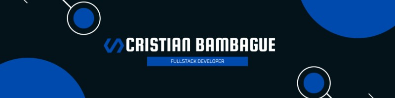

## 👋 Hi there, I'm Cristian Bambague

**Fullstack Software Developer | Java & Angular Specialist | Cloud Enthusiast**

---

### 🚀 About Me

I'm a passionate and results-driven software engineer from Colombia 🇨🇴 with experience building scalable and innovative applications. I enjoy working across the full stack and have a special interest in clean architecture, microservices, and cloud-native solutions.

💼 Currently working as a **Software Engineer at Bancolombia**, contributing to healthcare-related applications and cloud infrastructure.

🔧 Previously, I was a **Fullstack Developer at Horisoft**, where I helped modernize enterprise platforms with cutting-edge technologies.

---

### 🛠 Tech Stack & Tools

**Frontend**  
  

**Backend**  
  

**Databases**  
 

**DevOps & Cloud**  
   
 

**Testing**  
  

---

### 🌍 Let's Connect

- 📫 **Email:** [axceldev98@gmail.com](mailto:axceldev98@gmail.com)  
- 🔗 **LinkedIn:** [linkedin.com/in/axceldev](https://linkedin.com/in/axceldev)  
- 💻 **Portfolio:** [axceldev.github.io](https://axceldev.github.io)  
- 🐙 **GitHub:** [github.com/axceldev](https://github.com/axceldev)

---

### 📈 GitHub Stats

  

---

### ⚡ Fun Fact

> “Great software is not built alone. It’s built through collaboration, coffee, and continuous improvement.” ☕

---

_Thanks for visiting my profile! Feel free to explore my repositories or reach out to collaborate 🤝_
